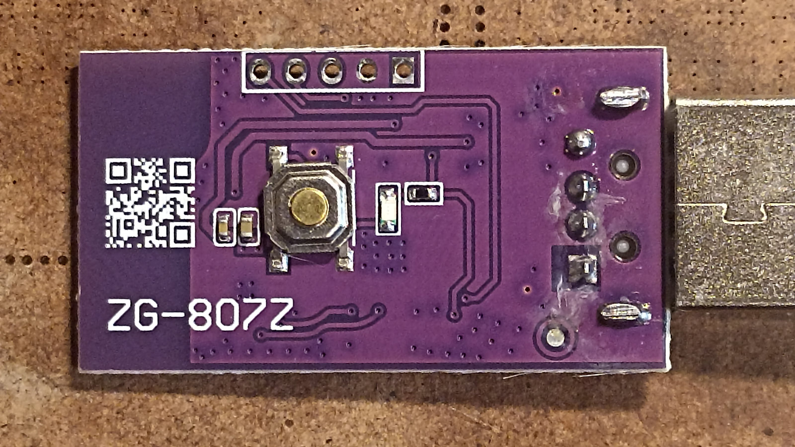
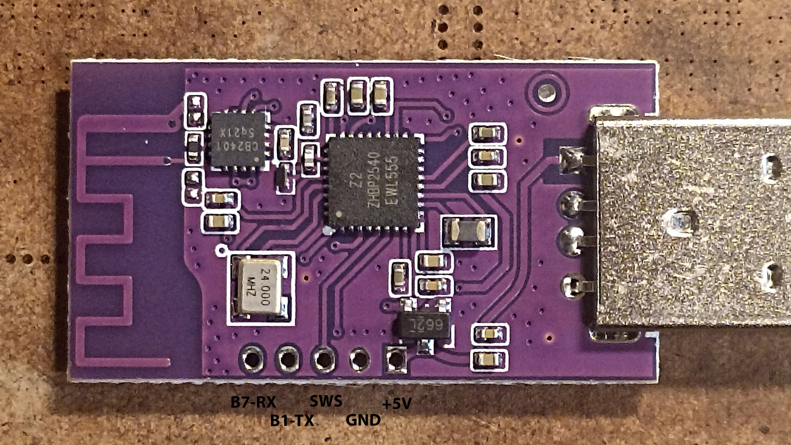
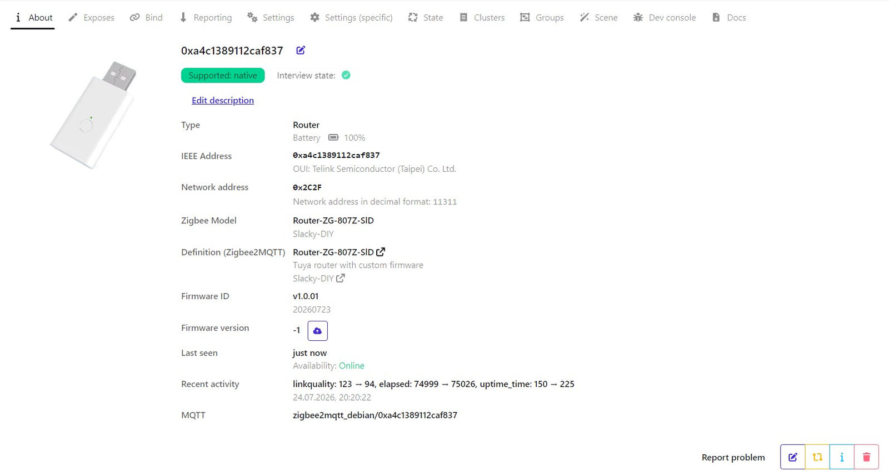
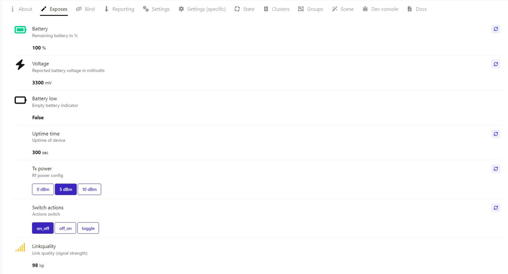

# <a id="Top">Tuya Zigbee Router with custom firmware</a>

	CK-BL702-ROUTER-01(7018) _TZ3000_piuensvr
	
**Оригинальная прошивка имеет кластер ОТА, но обновление не поддерживает.**

---

Предназначен для обеспечения функционирования сети `zigbee` при полном обесточивании помещения. Предполагается использование вместе с каким-нибудь небольшим бесперебойником, например на АКБ 18650, который имеет USB Type-A на выходе.

Нормальным считается напряжение на входе USB более 3.0 вольт. Уверенно работает до 2.6 вольт.

---

## Как обновить. 

### Роутер можно обновить только проводами.

Как залить прошивку можно почитать [тут](https://github.com/pvvx/ATC_MiThermometer?tab=readme-ov-file#the-usb-com-adapter-writes-the-firmware-in-explorer-web-version). 
 
Зайдите на страницу [USBCOMFlashTx.html](https://pvvx.github.io/ATC_MiThermometer/USBCOMFlashTx.html). Назначьте порт - `Open`. Нажмите на кнопку на роутере, светодиод должен моргнуть. Далее нажмите `Erase All Flash`. Когда в логе отразится, что очистка завершена, снова нажмите на кнопку. Светодиод не должен моргать. Если он моргнет, значит вы ничего не стерли - проверьте подключение. Если не моргает, значит все хорошо. Выберите файл `router_zg_807z_zrd_V1.0.xx.bin`. И нажмите `Write to Flash`. 

Еще можно собрать полноценный [программатор](https://github.com/pvvx/TLSRPGM) на [TB-03F-KIT](https://ali.click/5h5wg1w) или [TB-04-KIT](https://ali.click/bi5wg1o).

---

Связаться со мной можно в **[Telegram](https://t.me/slacky1965)**.

### Если захотите отблагодарить автора, то это можно сделать через [ЮMoney](https://yoomoney.ru/to/4100118300223495)

## История версий
- 1.0.01
	- Начало.

[Наверх](#Top)

